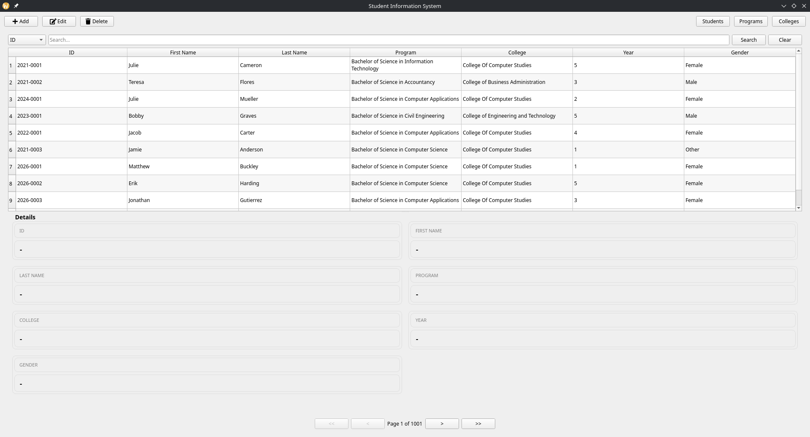

# Simple Student Information System
PyQt5 implementation of a student information system




# Project Setup Guide


## 1. Clone the Repository

```bash
git clone
```

---

## 2. Create a Virtual Environment

```bash
python -m venv venv
```

---

## 3. Activate the Virtual Environment

* **Windows:**

```bash
venv\Scripts\activate
```

* **Mac/Linux:**

```bash
source venv/bin/activate
```

---

## 4. Install Dependencies

```bash
pip install -r requirements.txt
```

---

## 5. Run the Application

```bash
cd src
python main.py
```

---

## 6. Deactivate Virtual Environment (optional)

```bash
deactivate
```

---


